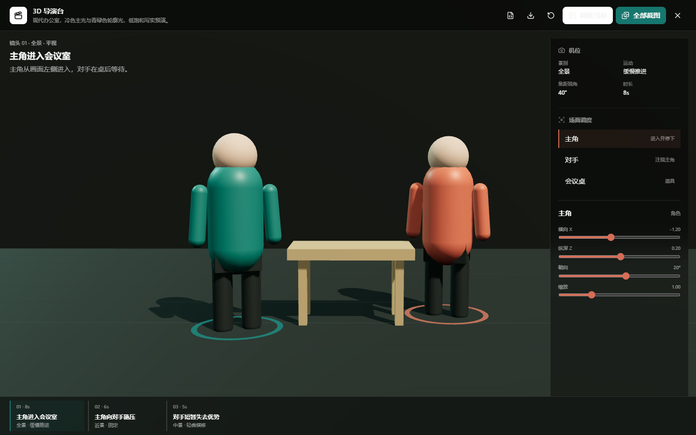

# 卡藏提示词画布

面向 AI 图片与视频创作的节点式工作台。把提示词、参考素材、生成配置、画布 Agent、创作资料库和 3D 分镜预演放在同一个可持续整理的画布中。

[在线体验](https://infinite-canvas-jay.vercel.app/canvas) · [卡藏提示词库](https://prompt-hubs.com) · [API 中转](https://newapi.prompt-hubs.com) · [部署指南](DEPLOY.md)



## 核心能力

- **无限画布**：图片、文本、视频、音频和生成配置节点，支持连线、成组、框选、撤销重做、小地图与导入导出。
- **多模型生成**：支持 OpenAI 兼容与 Gemini 调用格式，可接入自定义图片、文本、视频和音频模型。
- **创作总监 Agent**：网页 Agent 或本机 Agent 读取真实画布，通过工具创建节点、连接流程、调用生成并维护结构化项目黑板。
- **3D 导演台**：把文字分镜转换为角色、道具、机位和 FOV，支持手动微调、镜头切换与批量生成 `1280x720` 预演截图。
- **创作资料库**：本地摄取书摘、笔记、字幕和合法案例，经过提炼与二次审核后生成静态知识索引；完整原文不进入前端包。
- **卡藏联动**：沿用卡藏账号登录、模型与积分，支持读取卡片库、保存画布图片为卡片，以及同步生成记录。
- **本地优先存储**：画布、素材和媒体默认保存在当前浏览器，并按卡藏账号隔离；可选 WebDAV 同步。
- **桌面与手机基础可用**：桌面负责密集编排，手机支持浏览、基础画布手势和 Agent 操作。

## 快速开始

要求 Node.js 20 或更高版本。

```bash
git clone https://github.com/study666-creme/infinite-canvas-jay.git
cd infinite-canvas-jay/web
npm ci
npm run dev
```

打开 [http://localhost:3000](http://localhost:3000)。当前用户区会要求使用卡藏账号登录；没有账号可前往 [prompt-hubs.com](https://prompt-hubs.com) 注册。

模型有两种来源：

1. 登录后直接选择卡藏已提供的图片模型。
2. 在设置中填写自己的 OpenAI 兼容或 Gemini `Base URL`、`API Key` 和模型。

生产构建：

```bash
cd web
npm run build
```

## 目录结构

```text
web/                    Next.js 主应用
canvas-agent/           本机画布 Agent、Codex/Claude 适配与 MCP
plugins/infinite-canvas Codex App 插件
web/knowledge/creative  本地创作资料收件箱与审核配置
docs/                   Fumadocs 文档站与开发文档
.github/                CI、发布工作流和 Issue/PR 模板
```

## 文档

- [部署与自托管](DEPLOY.md)
- [画布 Agent 架构](CANVAS-AGENT.md)
- [开源与第三方许可](OPEN-SOURCE.md)
- [创作资料库](web/knowledge/creative/README.md)
- [功能总览](docs/content/docs/overview/features.mdx)
- [数据与存储](docs/content/docs/development/canvas-data-structure.mdx)
- [待验证项目](docs/content/docs/progress/pending-test.mdx)
- [后续路线](docs/content/docs/progress/todo.mdx)

## 数据与安全边界

- 登录只负责身份、卡藏模型与受保护代理权限，**不代表画布已自动云同步**。
- 画布项目、素材、生成记录和大部分媒体默认位于浏览器 IndexedDB；清理浏览器数据前请导出或配置 WebDAV。
- 自定义 AI API Key 保存在当前浏览器并由前端直连对应服务，只应在可信设备上使用。
- 本机 Agent 默认仅监听 `127.0.0.1`；连接 token 能调用本机 Codex 和画布工具，不应提交或公开。

## 开源说明

本仓库基于 [basketikun/infinite-canvas](https://github.com/basketikun/infinite-canvas) 继续开发，并遵循 [GNU AGPL-3.0](LICENSE)。AGPL 允许使用、修改和商业运营，但分发或通过网络提供修改版本时需要履行对应源码提供义务。详细边界见 [OPEN-SOURCE.md](OPEN-SOURCE.md)。

Three.js 使用 MIT 许可证。导入的模型、HDRI、贴图、字体、书籍、字幕和案例拥有各自的版权与授权条件，不能因本仓库开源而自动获得商用许可。

## 参与项目

提交问题或代码前请阅读 [CONTRIBUTING.md](CONTRIBUTING.md) 和 [SECURITY.md](SECURITY.md)。
